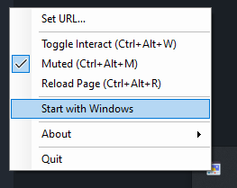

  

  

  

<h1 align="center">
  WebToBG 🌏
</h1>

Transform any <strong>webpage</strong> into your desktop wallpaper. Toggle <strong>interactive</strong> mode on-demand to interact with non-static websites, then toggle again to enable <strong>wallpaper</strong> mode. Other features include audio control, auto-start with Windows.

  <a href="https://github.com/LDY681/WebToBG/releases" target="_blank">
    📩 Downloads 📩
  </a>

  <g-emoji ios-version="6.0" fallback-src="https://assets-cdn.github.com/images/icons/emoji/unicode/26a0.png" alias="warning">⚠️</g-emoji>
  Built on <a href="https://dotnet.microsoft.com/en-us/download/dotnet/9.0/runtime">.NET 9.0</a>
  Requires <strong>Windows 7</strong> or later. See <a href="https://github.com/sindresorhus/Plash">Plash</a> if on MacOS.
  <g-emoji ios-version="6.0" fallback-src="https://assets-cdn.github.com/images/icons/emoji/unicode/26a0.png" alias="warning">⚠️</g-emoji>

  

  

    

<h2>Screenshots</h2>
<h3>Set a Webpage URL</h3>

 

<h3>Toggle Between Wallpaper and Interactive Modes</h3>

 

<h3>Mute Wallpaper / Enable Auto-Start with Windows</h3>

  

<h3>Set a file as Wallpaper (if you wish...)</h3>

  

  